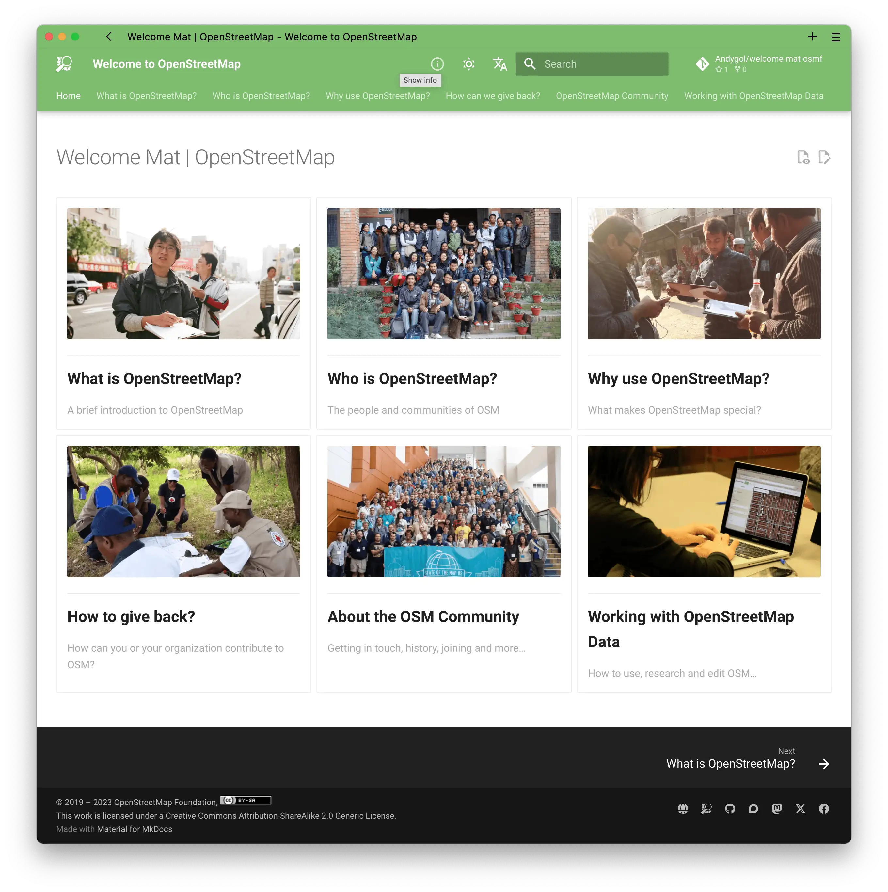
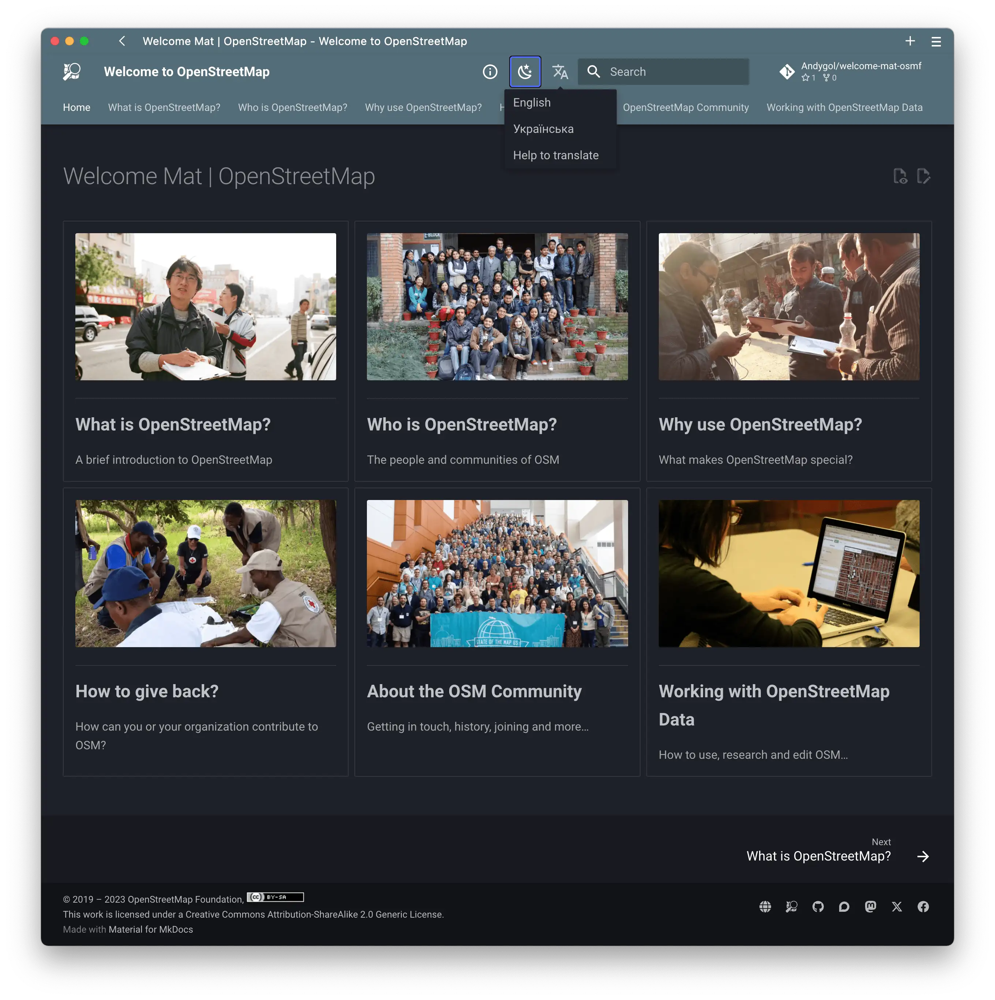

# Welcome Mat

Here is a re-work of <https://welcome.osm.org> website using [Material for MkDocs](https://squidfunk.github.io/mkdocs-material/).

The goal was to retain previous design using out-of-the-box features of MkDocs and add multilingual support, light and dark themes.

 | 
--- | ---

## Contribution

You are welcome to extend the styling and content, as well as add new languages. To get started, please clone this repository, install the necessary dependencies, and feel free to experiment. Once you've made your improvements, don't hesitate to submit a pull request with your suggestions. Your contributions are greatly appreciated!

```
git clone git@github.com:osmfoundation/welcome-mat.git
cd welcome-mat-osmf
python -m venv venv
source ./venv/bin/activate
pip install -r requirements.txt
mkdocs serve
```

Open <http://127.0.0.1:8000/welcome-mat-osmf/> in your browser.

## Translation

To add a translation in your language, follow these steps:

1. Begin by editing the `mkdocs.yml` file, which can be found at the root of the repository. To see an example of how to do this, refer to how the Ukrainian translation is added. Once completed, your language will be included in the language switcher, and all menu items and prompts will be displayed in your language.

2. Next, you can start translating the articles' text. Here's how:

   a. Duplicate the `en` folder and replace its name with your language code. Maintain the file names unchanged.

   b. Translate the values of the front matter keys in each Markdown file within your language folder.

   c. In each Markdown file, set the `lang` key in the front matter to match your language code, which should be the same as the name of your language folder.

   d. Preserve the Markdown formatting as is; there's no need to alter it.

3. If you have the `mkdocs serve` script running while making changes, the translated content will be automatically reflected in the displayed content after saving.

By following these steps, you can contribute translations to the project, making it accessible to a broader audience in your language.

## Copyright

The English language content from OSMF and its translation, respectively, are provided under the terms of the CC-BY License.
