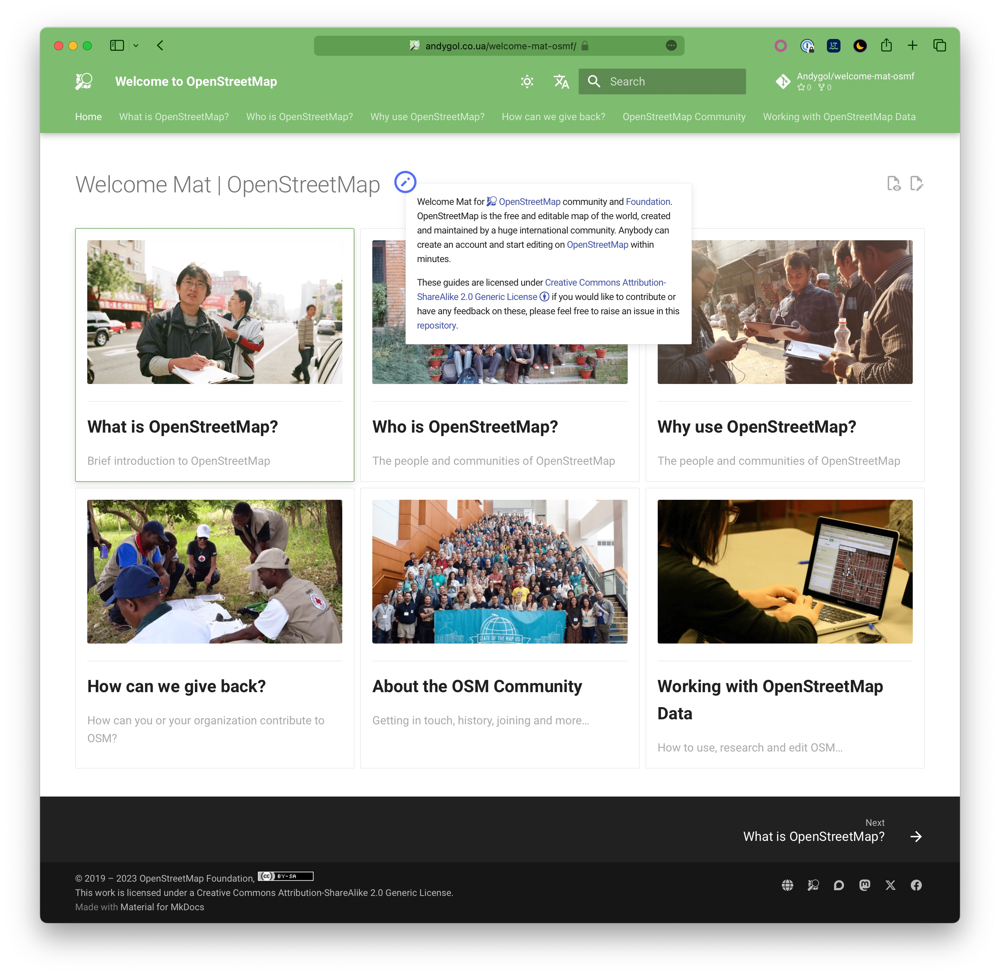
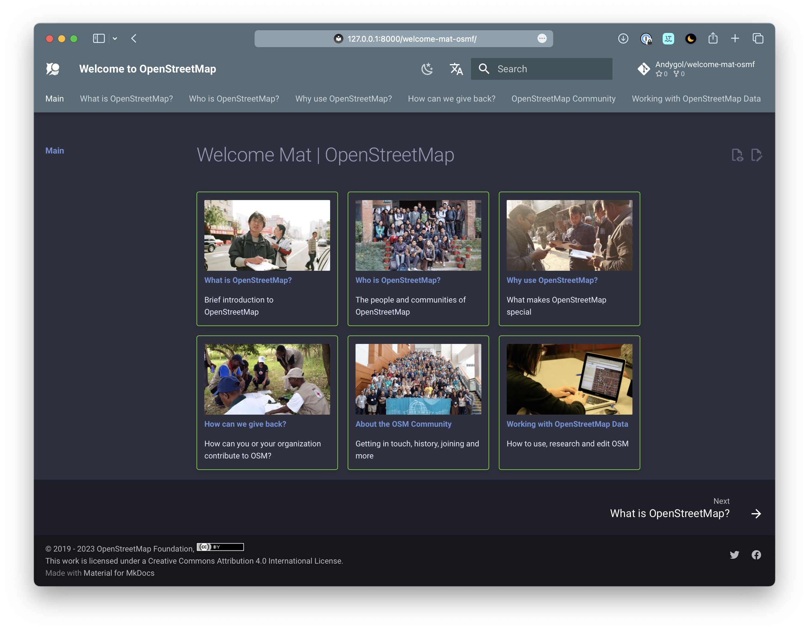

# Welcome Mat

Here is a re-work of <https://welcome.osm.org> website using [Material for MkDocs](https://squidfunk.github.io/mkdocs-material/).

The goal was to retain previous design using out-of-the-box features of MkDocs and add multilingual support, light and dark themes.

 | 
--- | ---

## Contribution

You are welcome to extend the styling and content, add new languages. To do this, clone this repository, install the necessary dependencies and experiment.

```
git clone git@github.com:Andygol/welcome-mat-osmf.git
cd welcome-mat-osmf
python -m venv venv
source ./venv/bin/activate
pip install -r requirements.txt
mkdocs serve
```

Open <http://127.0.0.1:8000/welcome-mat-osmf/> in your browser.

## Copyright

The English language content from OSMF and its translation, respectively, are provided under the terms of the CC-BY License.
