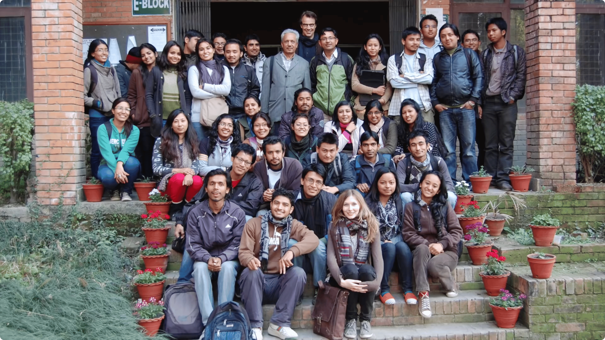
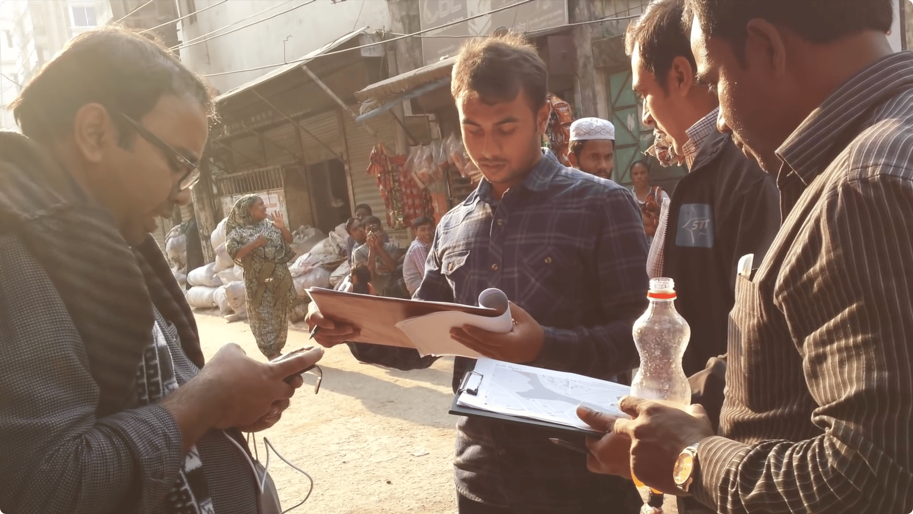
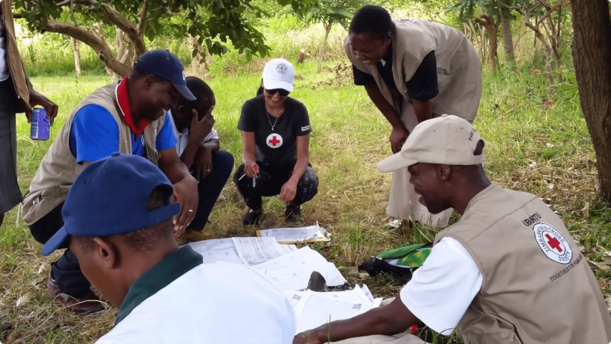
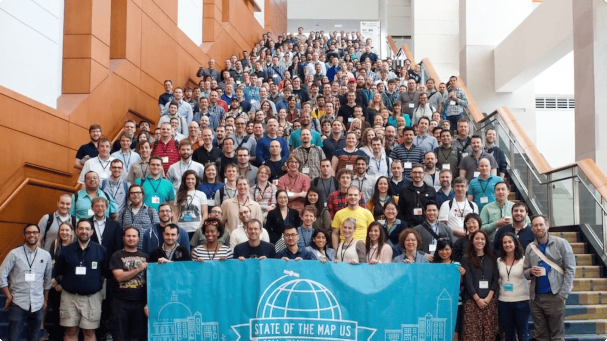
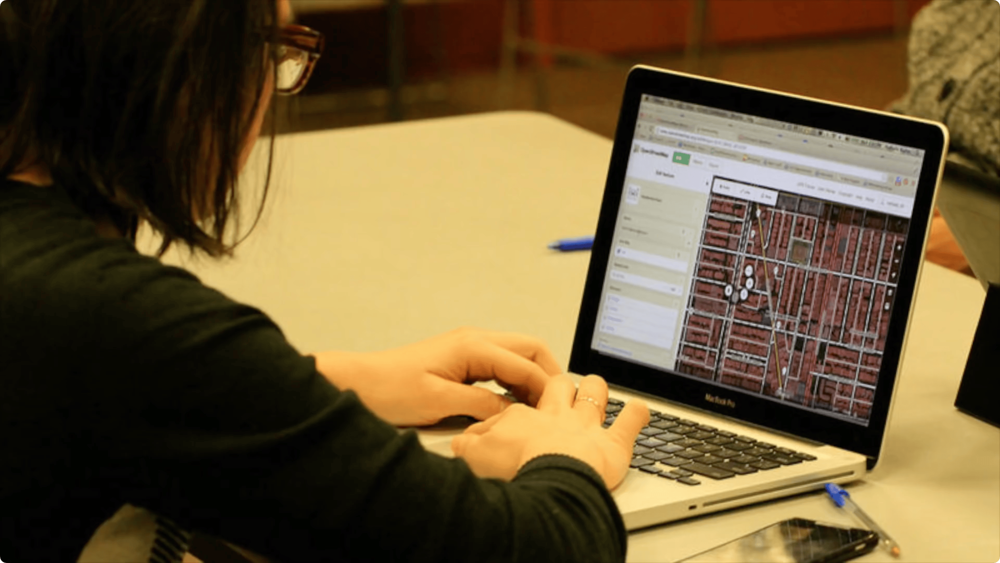

# Welcome Mat | OpenStreetMap (1) { .annotate }

1.  Welcome Mat for [:simple-openstreetmap: OpenStreetMap](https://www.openstreetmap.org){:target="_blank"} community and [Foundation](https://osmfoundation.org){:target="_blank"}. OpenStreetMap is the free and editable map of the world, created and maintained by a huge international community. Anybody can create an account and start editing on [OpenStreetMap](https://www.openstreetmap.org){:target="_blank"} within minutes.
    
    These guides are licensed under [Creative Commons Attribution-ShareAlike 2.0 Generic License :fontawesome-brands-creative-commons-by:](http://creativecommons.org/licenses/by-sa/2.0/){:target="_blank"} if you would like to contribute or have any feedback on these, please feel free to raise an issue in this [repository](https://github.com/osmfoundation/welcome-mat/issues){:target="_blank"}.

<!-- Screenshots are from https://youtu.be/Phwrgb16oEM -->

<!-- 
Current limitations:

- All tile headers must be on one line
-->

//// html | section.grid-container

/// html | div.tile
  { .link }
  

  ---
  
  **What is OpenStreetMap?**{ .item-title }

  A brief introduction to OpenStreetMap
  { .item-desc }
///

/// html | div.tile
  { .link }
  

  ---

  **Who is OpenStreetMap?**{ .item-title }

  The people and communities of OpenStreetMap
  { .item-desc }
///

/// html | div.tile
  { .link }
  

  ---

  **Why use OpenStreetMap?**{ .item-title }

  What makes OpenStreetMap special?
  { .item-desc }
///

/// html | div.tile
  { .link }
  

  ---
  
  **How can we give back?**{ .item-title }

  How can you or your organization contribute to OSM?
  { .item-desc }
///

/// html | div.tile
  { .link }
  

  ---

  **About the OSM Community**{ .item-title }

  Getting in touch, history, joining and more…
  { .item-desc }
///

/// html | div.tile
{ .link }

---

**Working with OpenStreetMap Data**{ .item-title }

  How to use, research and edit OSM…
  { .item-desc }
///

////
